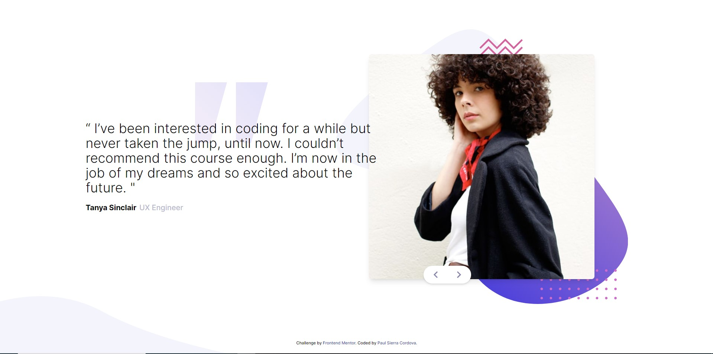

# Frontend Mentor - Coding bootcamp testimonials slider solution

This is a solution to the [Coding bootcamp testimonials slider challenge on Frontend Mentor](https://www.frontendmentor.io/challenges/coding-bootcamp-testimonials-slider-4FNyLA8JL). Frontend Mentor challenges help you improve your coding skills by building realistic projects. 

## Table of contents

- [Overview](#overview)
  - [The challenge](#the-challenge)
  - [Screenshot](#screenshot)
  - [Links](#links)
- [My process](#my-process)
  - [Built with](#built-with)
  - [What I learned](#what-i-learned)
  - [Continued development](#continued-development)
  - [Useful resources](#useful-resources)
- [Author](#author)
- [Acknowledgments](#acknowledgments)

**Note: Delete this note and update the table of contents based on what sections you keep.**

## Overview

### The challenge

Users should be able to:

- View the optimal layout for the component depending on their device's screen size
- Navigate the slider using either their mouse/trackpad or keyboard

### Screenshot

### Links

- Solution URL: [Click Here](https://www.frontendmentor.io/solutions/responsive-testimonial-slide-with-tailwind-css-and-js-w4KpxGl5F2)
- Live Site URL: [Click Here](https://paulsierracordova-testimonialslide.netlify.app/)

## My process

### Built with

- Semantic HTML5 markup
- Tailwind CSS
- JS
- Responsively APP
- Mobile-first workflow
- Chat GPT (to solve questions)

### What I learned

I improved my skills using Tailwind. My knowledge about positioning with relative and absolute positioning attributes also got better. There were some attributes that I've never used, but I had to, and that was the best part of it.

## Author

- Website - [Paul Sierra Cordova](https://paulsierracordova-portafolio.netlify.app/)
- Frontend Mentor - [@PaulSierraFISI](https://www.frontendmentor.io/profile/PaulSierraFISI)

