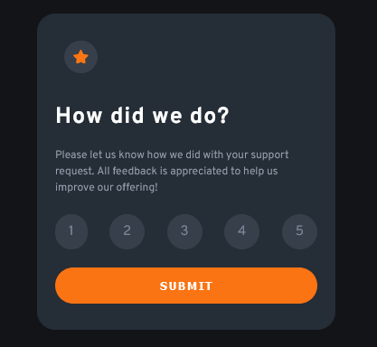

# Frontend Mentor - Interactive rating component solution

This is a solution to the [Interactive rating component challenge on Frontend Mentor](https://www.frontendmentor.io/challenges/interactive-rating-component-koxpeBUmI). Frontend Mentor challenges help you improve your coding skills by building realistic projects. 

## Table of contents

- [Overview](#overview)
  - [Screenshot](#screenshot)
  - [Links](#links)
- [My process](#my-process)
  - [Built with](#built-with)
  - [What I learned](#what-i-learned)
  - [Continued development](#continued-development)
- [Author](#author)

**Note: Delete this note and update the table of contents based on what sections you keep.**

## Overview

### Screenshot



### Links

- Solution URL: [https://www.frontendmentor.io/solutions/interactive-rating-component-htmlcss-js-g6trHvrU1M](FrontEndMentorSolution)
- Live Site URL: [https://paulsierracordova-irc.netlify.app/](WebSite)

## My process

### Built with

- Semantic HTML5 markup
- CSS custom properties
- Flexbox

### What I learned

The most important tip that I learned here is:
If I want to modifie the styles, I must to do it adding and removing classes. Sometimes is really hard to do it all from CSS, so I can save time doing it from JS.
There's a sample of my code where I use this tip:

```html
<div class="container_ratings">
  <div class="rating">1</div>
  <div class="rating">2</div>
  <div class="rating">3</div>
  <div class="rating">4</div>
  <div class="rating">5</div>
</div>
```
```css
.rating--active{
    background-color:   var(--Orange);
    color:var(--White);
} 
```
```js
ratings.forEach(rating=>{
        rating.classList.remove('rating--active');
    });
       
    if (estilos.contains('rating--hover')){
        estilos.remove('rating--hover');
    }
    estilos.add('rating--active');
```
### Continued development

In my future projects I'll be focused on the desings and save time in details. Maybe I can use a framework CSS like TailwindCSS.

## Author

- Website - [Paul Sierra Cordova](https://paulsierracordova-irc.netlify.app/)
