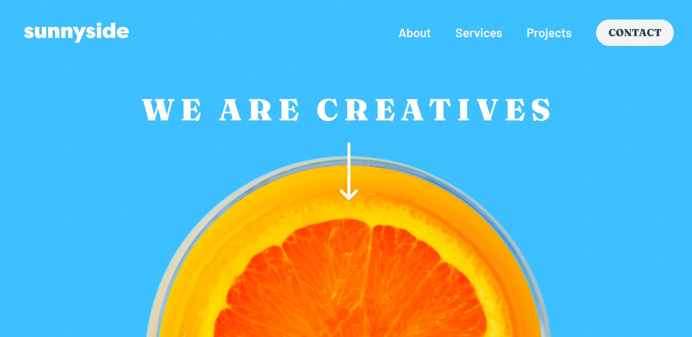

# Frontend Mentor - Sunnyside agency landing page

This is a solution to the [Sunnyside agency landing page](https://www.frontendmentor.io/challenges/sunnyside-agency-landing-page-7yVs3B6ef). Frontend Mentor challenges help you improve your coding skills by building realistic projects. 

## Table of contents

- [Frontend Mentor - Sunnyside agency landing page](#frontend-mentor---sunnyside-agency-landing-page)
  - [Table of contents](#table-of-contents)
  - [Overview](#overview)
    - [The challenge](#the-challenge)
    - [Screenshot](#screenshot)
    - [Links](#links)
  - [My process](#my-process)
    - [Built with](#built-with)
    - [What I learned](#what-i-learned)
  - [Author](#author)

**Note: Delete this note and update the table of contents based on what sections you keep.**

## Overview

### The challenge

Users should be able to:

- View the optimal layout for the site depending on their device's screen size
- See hover states for all interactive elements on the page

### Screenshot

### Links

- Solution URL: [Click Here](https://www.frontendmentor.io/solutions/responsive-intro-section-with-tailwindcss-and-mobile-first-approach-WxXqwAcdtE)
- Live Site URL: [Click Here](https://paulsierracordova-sunny-agency.netlify.app/)

## My process

### Built with

- Semantic HTML5 markup
- Tailwind CSS
- JS
- Responsively APP
- Mobile-first workflow
- Chat GPT (to solve questions)
- Js Events

### What I learned

I improved my skills using Tailwind. My knowledge about positioning with relative and absolute positioning attributes also got better. There were some attributes that I've never used, but I had to, and that was the best part of it. No doubt, I put in practice my css grid and flexbox skills once more.

## Author

- Website - [Paul Sierra Cordova](https://paulsierracordova-portafolio.netlify.app/)
- Frontend Mentor - [@PaulSierraFISI](https://www.frontendmentor.io/profile/PaulSierraFISI)
